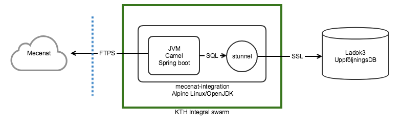

# integral-mecenat-integration

A docker container to generate information from Ladok3 Uppföljningsdatabas to Mecenat, a company
for student benefits and cards.

It is provided publically in the hope that someone else might find it useful. Improvements and
suggestions are always welcome. Please file an issue or a pull request here.

## Configuration

The application is based on the frameworks [Apache Camel](https://camel.apache.org/) 
and [Spring Boot](https://projects.spring.io/spring-boot/).

The default properties file `application.properties` is loaded from the path
`/run/secrets,/opt/data,/opt/camel`. See example of application.properties below.

The configuration can (mostly) also be specified as environment variables, where e.g.
sql.database is expressed as the environment variable SQL_DATABASE. You can use combinations
of properties and environment.

In a docker swarm environment it is suggested to supply application.properties and certificate
files using the docker secret mechanism, which means that they will be visible in /run/secrets
from the container.

If you are not using docker swarm the certificate files and configuration can instead 
be exposed by a volume mounted at /opt/data in the container. Paths to the certificate
files needs to be amended using either properties or environment variables.

### Settings reference

| property     | environment   | description    | default          |
|--------------|---------------|----------------|------------------|
| ladok3.database          | LADOK3_DATABASE   | The ladok3 database name, required | |
| ladok3.username          | LADOK3_USERNAME   | The ladok3 database user, required | |
| ladok3.password          | LADOK3_PASSWORD   | The ladok3 database password, required | |
| ladok3.cron              | LADOK3_CRON   | A cron-like quartz trigger expression, optional | 0 0 6-22 ? \* MON-FRI |
| mecenat.host             | MECENAT_HOST | Hostname of Mecenat ftp server, optional. | ftp.mecenat.se:990 |
| mecenat.username         | MECENAT_USERNAME | Username for Mecenat ftp server, required. | |
| mecenat.password         | MECENAT_PASSWORD | Password for Mecenat ftp user, required. | |
| mecenat.customernr       | MECENAT_CUSTOMERNR | Mecenat customer number, required | |
| redelivery.retries       | REDELIVERY_RETRIES | Max number of retries on failure, optional | 6 |
| redelivery.delay         | REDELIVERY_DELAY | Initial delay in ms, doubled on each retry up to max delay, optional | 1000 |
| redelivery.maxdelay      | REDELIVERY_MAXDELAY | Max delay in ms, optional | 60000 |
| spring.profiles.active   | SPRING_PROFILES_ACTIVE | Active Spring profiles, optional | bunyan |
| mecenat.wiretap.dir      | MECENAT_WIRETAP_DIR | Where to dump latest mecenat file to, optional | /opt/data/mecenat |
| *none*                   | LADOK3_CERT     | Path to the ladok3 user certificate, optional | /run/secrets/ladok3-user.crt |
| *none*                   | LADOK3_CERT_KEY | Path to the the certificate key (unencrypted), optional | /run/secrets/ladok3-user.key |

### Example

Below are the settings required for the application to work. Additional settings can be made.
A skeleton is available in application.properties.in.

```
# application.properties
#
ladok3.database=ufliusd
ladok3.username=lkasjda
ladok3.password=lSAJasdkASDD

mecenat.username=XYZ
mecenat.password=kajhsdkjahdjk
mecenat.customernr=00

# Log configuration, examples
# logging.level.org.apache.camel=DEBUG
# logging.level.se.kth.integral=DEBUG
```

### Logging

Logging is done with spring-boot default logger, [logback](https://logback.qos.ch/), and
can be configured at runtime with properties in application.properties. Note that it is
*not* possible to set these with environment variables due to case mangling issues.

Properties are of standard log4j like type, with the package name and level, prefixed by
`logging.level`, e.g., `logging.level.se.kth.integral=DEBUG`. See example above.

Logging from the container is done to stdout, and it is assumed that the logs are handled
further with configuration of docker logging,
[Configure logging drivers](https://docs.docker.com/config/containers/logging/configure/)

### Debug Mecenat output

The latest generated file to be sent to Mecenat is written to a file using a wire tap, default
`/opt/data/mecenat/latest.txt`. You can capture this be either mounting a writeable volume
to `/opt/data`, or by connecting to the running container with `docker exec` and 
investigate the file within the container itself. Se documentation of Docker.

#### Format

By default this application uses [Bunyan JSON](https://github.com/trentm/node-bunyan) formatting
for logs using the [bunyan-layout](https://github.com/KTH/bunyan-layout) package. This is a way
to log information to an indexing service such as Microsoft OMS, Greylog or Kibana in a structured
manner where multi-line content (stack traces) are kept together.

However, the JSON is not very human readable. You can use the `bunyan` filter tool from the Node
Bunyan repository to translate the log to a more readable format.

You can set the `spring.profiles.active` property to "nobunyan" to turn on a more normal text log
output. See the settings reference.

For more advanced configuration you need to adjust the file logback-spring.xml and put it on 
the classpath, or build your own container.

### Certificate for Ladok3

Certificate is assumed to be generated according to the instructions used by Ladok3 as of
this writing. Note that the key has to be unencrypted. In case it is, the password can be
removed with openssl `openssl rsa -in [file1.key] -out [file2.key]`.

Certificate of the server is verified by stunnel against included public CA chain for Terena 3 CA.

The certificate and key are expected to be found in /run/secrets/ladok3-user.crt and
/run/secrets/ladok3-user.key respectively. If you supply them from some other path, e.g. /opt/data,
you have to amend the environment variables LADOK3_CERT and LADOK3_CERT_KEY accordingly.
Note that it is *not* possible to set these with application.properties.

## Running

### Using the container with docker swarm

Create an application.properties file with the configuration.
Then create a docker secret and the service itself. Note that you can use
swarm mode on a single host, you don't need a cluster.

```
docker secrets create mecenat.properties application.properties
docker service create \
    --name mecenat \
    --secret mecenat.properties:application.properties \
    --network bridge \
    kthse/integral-mecenat-integration:latest
```

### Using the container without docker swarm

The image can be also be run without docker swarm as a simple container
using an environment file for the settings. There is a skeleton available
in environment.in. Alternatively you can put the configuration in a application.properties
file in the directory exposed as /opt/data to the container.

```
docker run \
    --env-file environment\
    -v /Users/username/some/dir:/opt/data
    kthse/integral-mecenat-integration:latest
```

## Development

The application is a spring-boot application and can be run from maven as `mvn spring-boot:run`.

You will have to configure an application.properties file in the current director and set
`wiretap.output.dir` to point to some writeable directory.



More general information about the software design is available in [Designval](doc/Designval.md).

### Connecting to the Ladok3 database

The Camel/Spring Boot application connects to a port on localhost. The connection
to the database itself is done by stunnel using the configuration in docker/opt/camel/etc/stunnel.conf.
It is hard coded to connect to Ladok3 production database host.

For development you can run the application using maven as mentioned above, and
run stunnel manually to provide the connection to Ladok. Use the stunnel.conf as a skeleton,
and adjust it to your needs.

### Updating the IBM DB2 driver

The IBM DB2 JDBC driver required for connecting to the database is not distributed in a public maven
repo. In order to work reasonably well during build it is instead installed manually to a local
repository within the project root. New versions of this driver can be downloaded and installed 
with maven with a command like below (adjust paths and version).

```
mvn org.apache.maven.plugins:maven-install-plugin:2.5.2:install-file\
    -Dfile=/path/to/ibm/driver/db2jcc4.jar\
    -DgroupId=com.ibm.db2.jcc\
    -DartifactId=db2jcc4\
    -Dversion=11.1.3.3\
    -Dpackaging=jar\
    -DlocalRepositoryPath=/path/to/the/project/root/repo
```

Update the version information of the dependency in pom.xml accordingly.

### Updating the trust store for the Mecenat FTP server

The Mecenat FTP server uses a self-signed certificate. The public key is kept in a JKS
keystore in the container and used to verify the server when uploading files. The keystore 
is sought for on the classpath. When it expires you have three options:

1. Create a new keystore and put in on the classpath by mounting a volume in /opt/data or
   if using docker swarm, use the secrets mechanism.
2. Build a new container with the updated keystore.
3. Disable certificate verification by removing the ftpClient argument
   to the ftps component in MecenatTransferRoute.java

A new keystore can be created by grabbing the new public key from the server using openssl,

```
openssl s_client -connect ftp.mecenat.se:990 </dev/null |\
    openssl x509 -text > ftp.mecenat.se.pem
```

The keystore is then generated with keytool in your Java distribution.

```
keytool -importcert -noprompt -alias mecenat \
    -keystore src/main/resources/ftp.mecenat.se.keystore \
    -file ftp.mecenat.se.pem \
    -storepass 46D5HQ8dkY 
```

Note, the keystore password serves no real purpose in this case, the keystore only
contains a public key, and the password is set in application.properties. If you
should use a different password, you also need to update application.properties.

### Building

Complete build and testing is run with maven: `mvn clean install docker:build`

Pre built docker images are available on public docker hub as kthse/integral-mecenat-integration.

See the Jenkins job at:
https://jenkins.sys.kth.se/view/Integral/job/integral-mecenat-integration/ (the server is not public).

### Release process with git flow

The project uses git-flow branch strategy, see
[introduction](http://nvie.com/posts/a-successful-git-branching-model/)
and the [git-flow tool](https://github.com/nvie/gitflow). Mainly all
development goes into development branch and via releases into master
which is built and pushed to docker hub by our internal Jenkins.

Set the version in all components with `mvn versions:set` from project root.

```
git flow release start x.y.z
mvn versions:set -DnewVersion=x.y.z
 *do whatever testing and update of RELEASENOTES.md*
 *commit changes*

git flow release finish x.y.z
```

It is possible to publish the release branch `git flow release publish x.y.z` to the 
repository if it is to be shared between developers or used in some CI environment.